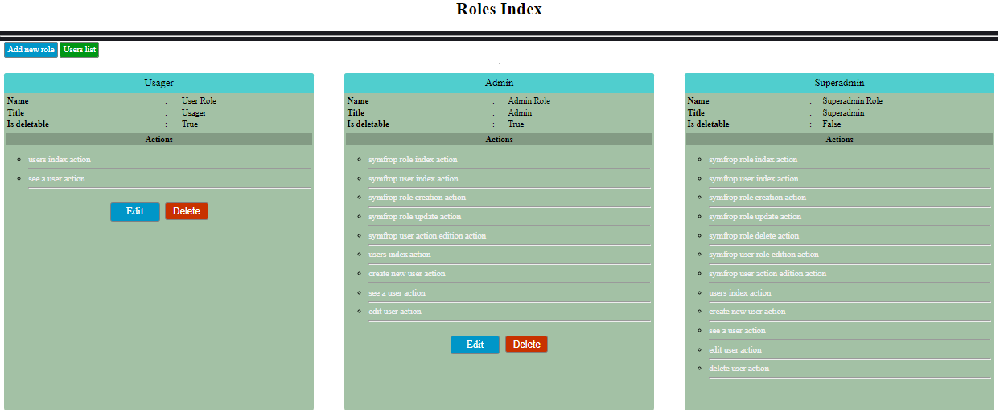
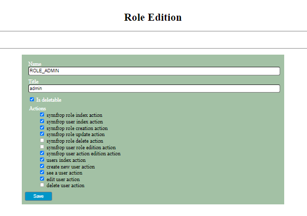
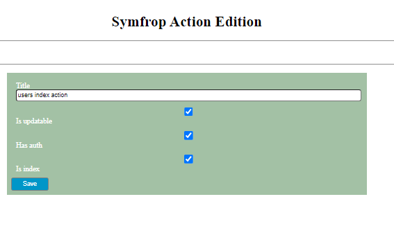
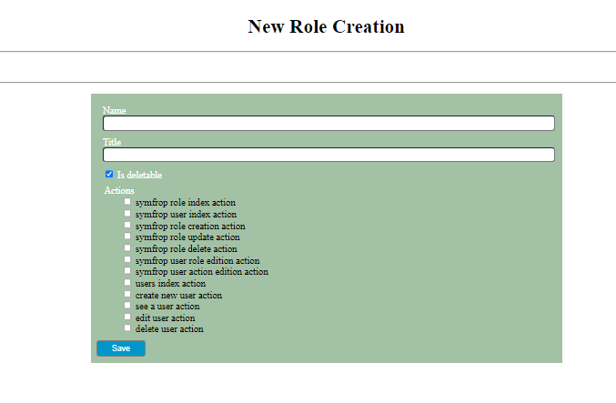

# SYMFONY FRONTEND ROLE PERMISSION BUNDLE

A Symfony frontend role permission bundle. This bundle allow site administrator to manage user roles and permissions.

## CONTENTS

-   [Some pages captures](#capture)
-   [Installation](#installation)
-   [How to use it?](#how_to_use_it)
    1. [Defining symfrop user action](#defining_symfrop_user_action)
    2. [Checking symfrop user action](#checking_symfrop_user_action)
    3. [Checking in a controller](#checking_in_a_controller)
    4. [Cheking in twig template](#cheking_in_twig_template)
    5. [translation in Symfrop bundle](#translation_in_symfrop_bundle)
    6. [Generate Entity Crud](#generate_entity_crud)
    7. [Override default symfrop controller method action](#override_method_action)
    8. [Inject top or/and bottom navbar, stylesheets tag and scripts tag](#Inject_navbar_style_script)
    9. [Change default symfrop style values](#change_style_values)

## SOME PAGES CAPTURES


<hr/>
<div align="center">


<hr/>

<hr/>
</div>

## INSTALLATION

Before installing this package, copy this configuration in config/packages/symfrop.yaml file in your symfony project

```yaml
symfrop_bundle:

  resources_info:
    App/Controller:  '%kernel.project_dir%/src/Controller'

  entities:
    entity:
      user_entity: 'Njeaner\Symfrop\Entity\User'
      role_entity: 'Njeaner\Symfrop\Entity\Role'
      action_entity: 'Njeaner\Symfrop\Entity\Action'
    form: 
      role_form: 'Njeaner\Symfrop\Form\RoleType'
      action_form: 'Njeaner\Symfrop\Form\ActionType'
      user_role_form: 'Njeaner\Symfrop\Form\UserRoleType'

  app_roles:
    ROLE_USER: 'user'
    ROLE_ADMIN: 'admin'
    ROLE_SUPERADMIN: ['root', false]
```

When the config file is copied in config/packages/symfrop.yaml, then install the package with the following command:

```php
composer require  njeaner/symfrop
```

After package installation, copy this code in config/routes/attributes.yaml

```yaml
controllers:
   resource: '@Symfrop\Controller\'
   type: attribute
```

 And generate Symfrop User, Role and Action entities with this command:

```php
php bin\console symfrop:entities [entities-folder]
```

or this command:

```php
symfony console symfrop:entities [entities-folder]
```

The optional [entities-folder] argument is the folder to contains your auth entities. if this argument is missed, the entities will be generated in src/Entity/ directory.
for example, "php bin\console symfrop:entities Auth" command will generate symfrop entities in src/Entity/Auth/ directory.

now in your config/packages/symfrop.yaml, changes this lines:

```yaml
    user_entity: 'Njeaner\Symfrop\Entity\User'
    role_entity: 'Njeaner\Symfrop\Entity\Role'
    action_entity: 'Njeaner\Symfrop\Entity\Action'
```

by this:

```yaml
    user_entity: 'App\Entity[\entities-folder]\User'
    role_entity: 'App\Entity[\entities-folder]\Role'
    action_entity: 'App\Entity[\entities-folder]\Action'
```

example:

```yaml
    user_entity: 'App\Entity\Auth\User'
    role_entity: 'App\Entity\Auth\Role'
    action_entity: 'App\Entity\Auth\Action'
```

or if entities is generated directly in src/Entity directory

```yaml
    user_entity: 'App\Entity\User'
    role_entity: 'App\Entity\Role'
    action_entity: 'App\Entity\Action'
```

NB: Your are not obligate to use symfrop command to generate entities, this command is an simple way to generate easily all needed entities. symfrop bundle use three central entities:

- an user entity which represente application users, this entity must implements **Njeaner\Symfrop\Entity\Contract\UserInterface** that extends symfony user interface;
- an role entity that define different type of role to use in the application, this entity must implements **Njeaner\Symfrop\Entity\Contract\RoleInterface**. Default roles are:
    1. ROLE_USER (a simple user role),
    2. ROLE_ADMIN (an administrator role),
    3. ROLE_SUPERADMIN (root role with all previlegies).
- an action entity that define all users actions in the application, this entity must implements **Njeaner\Symfrop\Entity\Contract\ActionInterface**. Each symfony controller action is an symfrop action that can be specified using symfrop class and methods attributes.

## HOW TO USE IT?

### **Defining symfrop user action**

Symfrop bundle use controller class and method attributes to define users actions and permissions in the application. Two attributes can be used to define a controller action:

- **Njeaner\Symfrop\Core\Annotation\Route** which is an extension of Symfony\Component\Routing\Annotation\Route with some added properties for symfrop bundle. when using this attribute, it not necessary to use more symfony routing attribute, because it accept all symfony routing attribute properties plus symfrop attribute properties.
- **Njeaner\Symfrop\Core\Annotation\RouteAction**. this attribute must be combine with symfony routing attribute. thus, any symfony controller action must contains two methods attributes instances: a Symfony\Component\Routing\Annotation\Route to define symfony routing and Njeaner\Symfrop\Core\Annotation\RouteAction to define symfrop user action.

symfrop attribute properties are:

- **name(required)**: to define the action name
- **title(optionale)**: to define action title, if it value is missing, name value will be used
- target(optional): string or array value to define role associated to an defined action.
- isUpdatable(default: true): define if and action is updatable or no.
- hasAuth(default: true): define if an controller action is authenticable by symfrop bundle or no. each controller action function that do not get symfrop attribute is not authenticable by the bundle.
- isIndex(default: false): to specify if the action is and index action
- updatedRole(default: false): this is use when attribute target value is modified. it permit to update database role correspondances.
- isUpdated(default: false): this is use when (an) attribute(s) property value is changed. this allow to update database values.
- actionCondition(default: null): supplementary condition to check during authorization checking
- conditionOption: use with actionCondition property to specify if the actionCondition will override authorization checking, or wil be combined with it.
Njeaner\Symfrop\Core\Annotation\RouteAction attribute accept only these properties. Njeaner\Symfrop\Core\Annotation\Route however combine these properties with Symfony\Component\Routing\Annotation\Route attribute properties to define at time, symfony routing action and symfrop user action.
 an simple example:

```php
namespace App\Controller\Auth;

use App\Repository\Auth\UserRepository;
use Njeaner\Symfrop\Core\Annotation\Route ;
use Njeaner\Symfrop\Core\Service\CONSTANTS;
use Symfony\Component\HttpFoundation\Request;
use Symfony\Component\HttpFoundation\Response;

#[Route('/auth/user/{_locale<fr|en|es|pt>?en}', requirements: ['_locale' => 'fr|en|es'])]
class UserController extends AbstractController
{
    // path, name, methods are for symfony routing. name, target, isIndex are for symfrop user action.
    #[Route(path: '', name: 'app_auth_user_index', methods: ['GET'], target: CONSTANTS::ROLE_ALL, isIndex: true)]
    public function index(UserRepository $userRepository): Response
    {
        return $this->render('auth/user/index.html.twig', [
            'users' => $userRepository->findAll(),
        ]);
    }
}
```

### **Checking symfrop user action**

The symfrop authorization are checking in a kernel.request event and before controller instanciation. the bundle use current route name and current security user to chech action authorization.

### **Checking in a controller**

Sometimes we can need to check in a controller action if some route is authorized or no.

```php
//...
use Njeaner\Symfrop\Core\Manager\AnnotationManager;
class UserController extends BaseAppController
{
    // path, name, methods are for symfony routing. name, target, isIndex are for symfrop user action.
    #[Route(path: '', name: 'app_auth_user_index', methods: ['GET'], target: CONSTANTS::ROLE_ALL, isIndex: true)]
    public function index(UserRepository $userRepository, AnnotationManager $am): Response
    {
        if($am->isAuthorize('some-route-name')){ // return true or false
            // do some action;
        }
        return $this->render('auth/user/index.html.twig', [
            'users' => $userRepository->findAll(),
        ]);
    }
}
```

### **Cheking in twig template**

Check user action authorization in twig template allow to show or hide a link, a form depending on user action permission. It allow for example to show user edit action link or form only for users that get permissions to edit users informations.

Symfrop bundle provide three way to check user action authorization in twig template:

- **create_symfrop_link** function that permit to create a link. with this twig function, the link is generate only if current user has action permission to process this link. it accept between 2 and 4 arguments:
    1. The Required first argument (of type string) is the route name.
    2. The Required second argument (of type string or array of two string) is label of the link. if is a array argument, the first array item will be link label, the second array item will be the text to show if the link is not generated.
    3. The Optional third argument is parameters to generate link href
    4. The Optional last argument is option to add some html tag attributes to the link, like class, id, title , style, ...

    EXAMPLE:

```twig
    {{ create_symfrop_link(
        'my_route_name',
        'link_label', {# or ['link_label', 'default_label'] #}
        {'param': 'param_value'},
        {'class': 'btn btn-primary', 'title': 'link_title'}
    ) }}    
```

- **symfrop** tag that permit to render a block only if user get an action permission. This is usefull to render a form only if user get permission to process form action. For , show edit user information form for only admin that have permission to edit user information. **symfrop** tag have an **else** tag that permit to render other thing if user no get permission to process the given action

EXAMPLE

```twig

 {# show some block #}


{# or #}


{# show some block #}

{# show other block  #}

```

- **is action autorized** if tag that permit to check if a user get an action route permission

EXAMPLE

```twig

 {# show some block #}


{# or #}


{# show some block #}

{# show other block  #}

```

### **translation in Symfrop bundle**

Symfrop bundle provide some twig function to process translation:

- **__** function that is symfrop basic locale translation function
- **__u** or **__U** functions that is ucfirst locale translation function
- **__t** or **__T** that is a derivation of symfony **title** filter.

USAGE EXAMPLES

```twig
    __('name') {# will return: "name" if request locale is english(en), "nom" if french(fr) or "nombre" if request locale is spanish(es)  #}
```

### **Generate Entity Crud**

Symfrop bundle provide a symfony equivalent make:crud command, to easily make a crud that generate controller with Njeaner\Symfrop\Annotations\RouteAction method attribute, form that include locale translation and view with symfrop action link and form permission checking.

Generate symfrop crud using php command

```php
php bin/console symfrop:crud
```

### **Override default symfrop controller method action**

Symfrop bundle by default use seven(07) controller methods to manage default bundle action. these are:

- **njeaner_symfrop_role_index** to show all defined roles;
- **njeaner_symfrop_user_index** to show all application users role;
- **njeaner_symfrop_role_create** for role creation;
- **njeaner_symfrop_role_update** for role edition;
- **njeaner_symfrop_role_delete** for delet a role;
- **njeaner_symfrop_user_role_edit** to edit an user role;
- **njeaner_symfrop_action_edit** to edit an user action.

to override ones or all of these action, you just need to create an symfony controller method with the same symfony route attribute name and the same symfrop attribute name.

For example:

```php
use Njeaner\Symfrop\Core\Annotation\RouteAction;

class MyCostumActionController{

    /*This will override default njeaner_symfrop_role_index that list all role list*/

    #[RouteAction(name: 'njeaner_symfrop_role_index')]
    public function roleIndex(){
        return $this->getRoleRepostory()->findAll();
    }
}
```

### **Inject top or/and bottom navbar, stylesheets tag and scripts tag**

Symfrop bundle allow top and bottom navbar injection, stylesheets and scripts tag injection in bundle default view. This permit to have the same navbar in all application include symfrop views. This injection must be configure in config/packages/symfrop.yaml, under *templates* section like this:

```yaml
templates: 
    navbar_top: my_top_navbar_file.html
    navbar_bottom: my_bottom_navbar_file.html
    scripts: ['my_first_script.js', 'my_other_script.js']
    stylesheets: ['my_first_style.css', 'my_other_style.css']
```

**NOTE:** Each section is facultative. you can inject only ones of these.


### **Change default symfrop style values**

All symfrop costum css classes with their values are present below. You can override some classes values in your costum css style file if you want. By inspecting a symfrop view page with your navigator, you can determine what classes values you want to override.

```css
            .symfrop-container{
                margin: 8px;
                padding: 8px;
                display: flex;
                justify-content: center; 
                flex-direction: column;
                padding-top: 40px;
                padding-bottom:60px;
            }

            .symfrop-row{
                display: flex;
                align-items: stretch;
                justify-content: space-between;
                flex-wrap: wrap;
            }
            
            .symfrop-col{
                padding: 4px;
                margin: 4px;
                width: 100%;
            }

            .symfrop-col-4{
                padding: 4px;
                margin: 4px;
                width: 25vw;
            }

            .symfrop-col-3{
                padding: 4px;
                margin: 4px;
                width: 30.5vw;
            }

            .symfrop-width-3{
                width: 30.5vw;
            }

            .symfrop-width-4{
                width: 25vw;
            }

            .symfrop-width-2{
                width: 50vw;
            }
            
            .symfrop-bg-dark{
                background-color: rgb(26, 26, 32);
            }
            
            .symfrop-form{
                width: 40vw;
                padding: 5px;
                padding: 10px;
                background-color: rgba(26, 100, 32, 0.4);
            }
            
            .symfrop-form-group{
                margin: 10px;
            }
            
            .symfrop-form-group > ul {
                color: red;
                padding-top: 0;
                padding-bottom: 0;
                margin-top: 0;
                margin-bottom: 0;
            }

            .symfrop-card{
                width: 100%;
                background-color: rgba(26, 100, 32, 0.4);
                min-height: 50px;
                border-radius: 5px;
                position: relative;
            }

            .symfrop-card-body{
                padding: 2px;
                min-height: 40px;
            }

            .symfrop-card-title{
                font-size: 1.2rem;
                padding: 8px;
                background-color: #50cece;
                border-radius: 5px 5px 0px 0px;

            }

            .symfrop-card-footer{
                font-size: 1.2rem;
                padding: 4px;
                border-radius: 0px 0px 5px 5px;
                min-height: 30px;
                display: flex;
                justify-content: center;
            }

            .symfrop-card-footer a{
                text-decoration: none;
            }
            
            .symfrop-display-block{
                display:block;
            }

            a{
                text-decoration: none;
            }
            
            .symfrop-input {
                width: 100%;
                height: 1.2rem;
                border-radius: 5px;
            }

            .symfrop-btn{
                min-width: 80px;
                min-height: 20px;
                border-radius: 4px;
                padding: 5px;
                border: 1px solid grey;
                background-color: grey;
            }
            
            .symfrop-btn:hover, input:hover{
                opacity: 0.7;
            }
            
            .symfrop-btn.symfrop-btn-primary{
                background-color: rgb(0, 150, 200);
                color: white;
            }

            .symfrop-btn.symfrop-btn-success{
                background-color: rgb(0, 150, 20);
                color: white;
            }

            .symfrop-btn.symfrop-btn-danger{
                background-color: rgb(200, 50, 0);
                color: white;
            }
            
            .symfrop-text-white{
                color: white;
            }
            .symfrop-text-center{
                text-align: center;
            }

            .symfrop-text-left{
                text-align: left;
            }
            .symfrop-text-right{
                text-align: right;
            }
            th, td{
                padding: 2px;
            }

            .symfrop-flex{
                display: flex;
            }
            .symfrop-flex-center{
                align-items: center;
                justify-content: center;
            }

            .symfrop-alert{
                margin: 4px;
                padding: 8px;
                border-radius: 5px;
                background-color: #cacaca;
                color: white;
                text-align: center;
            }
            .symfrop-alert.error{
                background-color: rgba(186, 86, 86, 0.7);
            }

            .symfrop-alert.symfrop-success{
                background-color: rgba(86, 186, 86, 0.7);
            }
```
